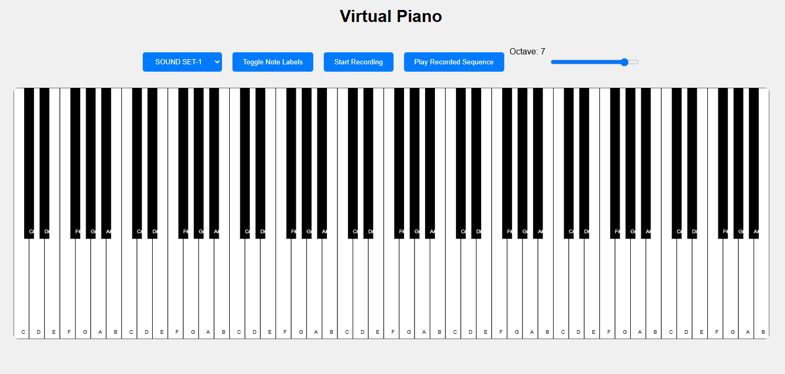

# Virtual Piano Application

This is a web-based virtual piano application that allows users to play musical notes using both mouse clicks and keyboard inputs. The application features a responsive design, making it accessible on various devices.

## Screenshot



## Live Demo

You can try out the virtual piano application hosted on GitHub Pages: [Live Demo](https://pakkid.github.io/virtual-piano)

## Project Structure

```
virtual-piano-app
├── src
│   ├── css
│   │   └── styles.css       # Contains the CSS styling for the piano
│   ├── js
│   │   └── script.js        # Contains the JavaScript functionality for the piano
│   ├── audio
│   │   ├── C.mp3            # Audio file for note C
│   │   ├── D.mp3            # Audio file for note D
│   │   ├── E.mp3            # Audio file for note E
│   │   ├── F.mp3            # Audio file for note F
│   │   ├── G.mp3            # Audio file for note G
│   │   ├── A.mp3            # Audio file for note A
│   │   └── B.mp3            # Audio file for note B
│   └── index.html           # HTML structure for the virtual piano
└── README.md                # Documentation for the project
```

## Getting Started

To set up the virtual piano application, follow these steps:

1. **Clone the repository**:
   ```
   git clone <repository-url>
   ```

2. **Navigate to the project directory**:
   ```
   cd virtual-piano-app
   ```

3. **Open the `index.html` file** in your web browser to start using the virtual piano.

## Usage

- Click on the piano keys to play notes.
- Use the keyboard keys (C, D, E, F, G, A, B) to play corresponding notes.

## License

This project is licensed under the MIT License. See the [LICENSE](LICENSE) file for details.